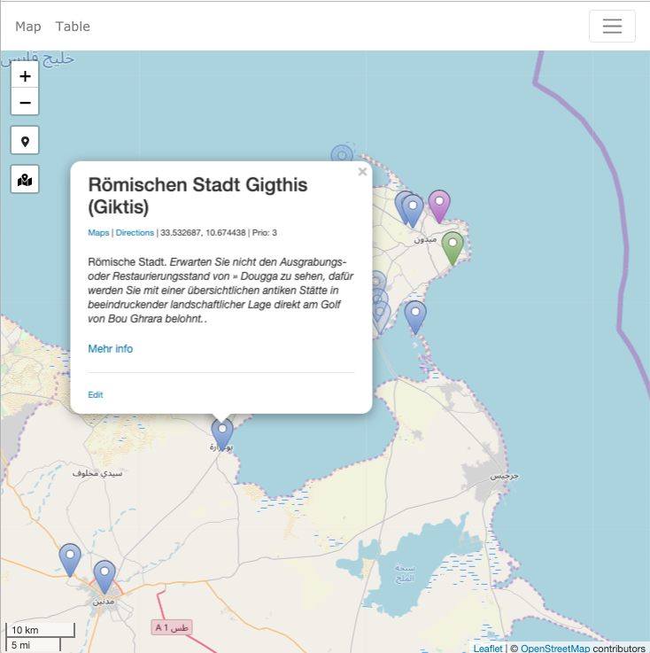

# POI Map

This is a simple map on which you can store point of interest to you. Think of it as a geographical to-do list. I use it to store POIs I want to visit someday and write down notes about places I visited. 

## Installation

- Clone the Repo
- Copy the `.env.example` to `.env` and set your configs
- Run `$ composer install`
- Change the database seeders to your needs (`database/seeds/`). You have to change the default user in `UsersTableSeeder.php`. You might want to exclude the `PlacesTableSeeder.php`. It holds some locations I use during development.
- Run the migrations `$ php artisan migrate`
- Login and create your first categories and places! 

Since this is mostly a private project for myself, there might be some incomplete or missing steps. If you run into any trouble or have some suggestions, please reach out!

## Development information

- Reload autoloading: `$ composer dump-autoload`
- Enter Docker container for database relevant tasks: `$ docker-compose exec webserver bash`
- Execute all migration and refresh: `$ php artisan migrate:refresh --seed`

### Deployment

- Create new Laravel recipe for [Deployer](https://deployer.org/) with: `$ ./vendor/bin/dep init`
- Deploy `$ ./vendor/bin/dep deploy`
